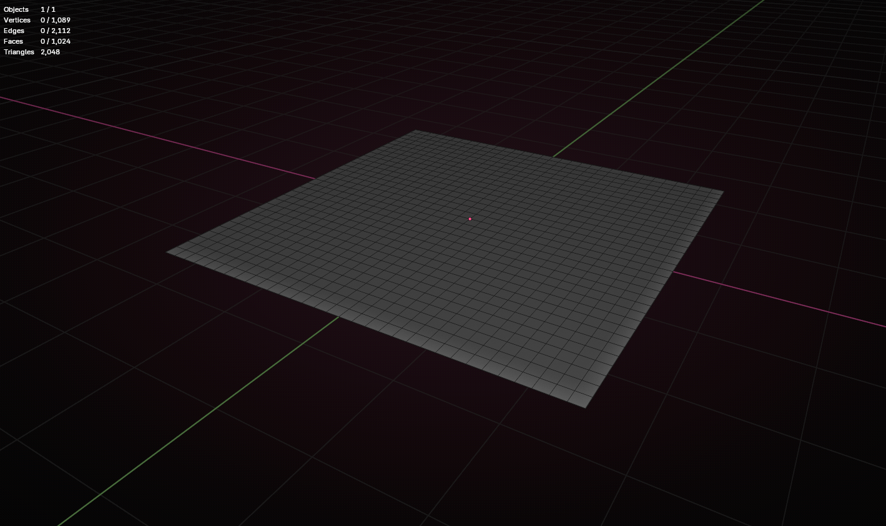
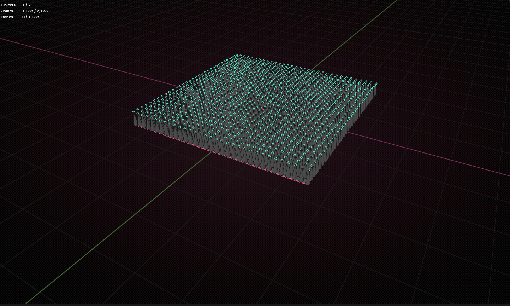

As a first step, i will use a very simple 3d mesh: a flat plane.

Each vertex of this mesh will be associated with a bone, so the mesh can later be deformed.





Obs:
- This Mesh is a 32x32 faces plane, so it has 1024 vertices and the same amount of bones
- The bones were generated by the following python code, ran in blender:

```

import bpy
import bmesh
from mathutils import Vector

BONE_LENGTH = 0.4
POINT_UP_GLOBAL = True
NAME_PREFIX = "WaveBone_"

def create_bones_pointing_up():
    obj = bpy.context.active_object
    
    if not obj or obj.type != 'MESH':
        print("Select a mesh as active object!")
        return
    
    if bpy.context.mode != 'EDIT_MESH':
        print("You must be in Edit Mode with vertices selected!")
        return
    
    mesh = obj.data
    bm = bmesh.from_edit_mesh(mesh)
    bm.verts.ensure_lookup_table()
    
    selected_verts = [v for v in bm.verts if v.select]
    
    if not selected_verts:
        print("No vertices selected!")
        return
    
    print(f"Creating {len(selected_verts)} bones for selected vertices...")
    
    arm_data = bpy.data.armatures.new("WaveArmature")
    arm_obj = bpy.data.objects.new("WaveArmature", arm_data)
    bpy.context.collection.objects.link(arm_obj)
    
    bpy.context.view_layer.objects.active = arm_obj
    for o in bpy.data.objects:
        o.select_set(False)
    arm_obj.select_set(True)
    
    bpy.ops.object.mode_set(mode='EDIT')
    
    for i, vert in enumerate(selected_verts):
        head = obj.matrix_world @ vert.co
        
        if POINT_UP_GLOBAL:
            direction = Vector((0, 0, 1))
        else:
            direction = (obj.matrix_world.to_3x3() @ vert.normal).normalized()
        
        tail = head + direction * BONE_LENGTH
        
        bone_name = f"{NAME_PREFIX}{i:04d}"
        bone = arm_data.edit_bones.new(bone_name)
        bone.head = head
        bone.tail = tail
        bone.align_roll(direction)
    
    bpy.ops.object.mode_set(mode='OBJECT')
    
    obj.select_set(True)
    bpy.context.view_layer.objects.active = obj
    
    print("Done! Bones created.")
    print("Next: Add Armature Modifier to the mesh → Object = WaveArmature")
    print("Use Envelopes for quick deformation or Vertex Groups for precise control.")

create_bones_pointing_up()

```