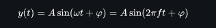
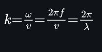
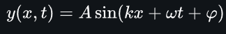

### Sinusoidal Waves

To start small, i tried doing a simple sine wave, which is a wave descripted by the following variables:

- Amplitude
- Time
- Angular frequency / Ordinary Frequency
- Phase

Into this formula:

But, actually im trying to simulate a wave at the 3d space, so i got a slightly different formula

New variables:

- Spatial Variable "x" that represent the position which the wave will propagate.
- Wave Length, used to get the proportionality between the angular frequency (w) and the linear speed (speed of propagation) v:

In this project im using the last option.

Once we setup that, we can build the main **Spacial Sin Wave Formula**

