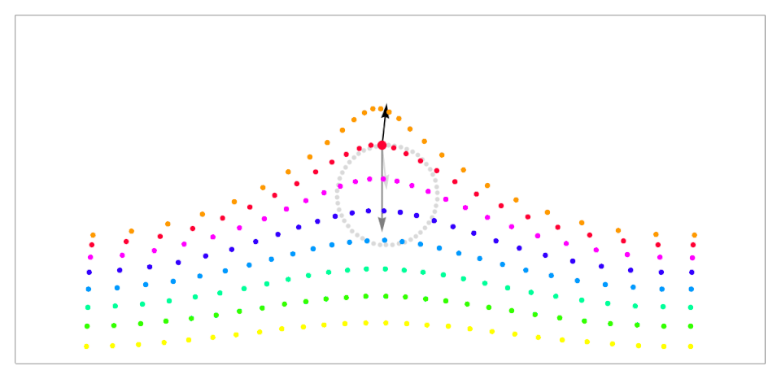
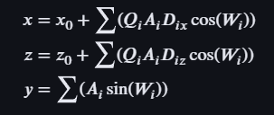
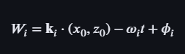

### Trocoidal Waves

Trochoidal (or Gerstner) waves, are more accurate and realistic waves. Moving the particles along a orbital x and y axis. Like this

Descripted by the following formula

Where W is

Variables

A = Amplitude
D (Dx, Dz) = Direction Vector
Q = Steepness
K = Wave Number (Wave Length)
W = Angular Frequency
