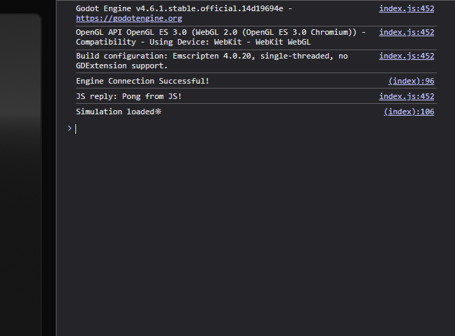

## Godot Web Export

One of the goals of this project was to make it run on the web. So I used parts of the official Godot documentation to learn how the web export works. These pages were:

1. [Exporting for the Web](https://docs.godotengine.org/en/4.4/tutorials/export/exporting_for_web.html)

- Introduces how to export a Godot project as an HTML file and highlights the limitations of this approach.

2. [Custom HTML page for Web export](https://docs.godotengine.org/en/4.4/tutorials/platform/web/customizing_html5_shell.html)

- Shows how to export the project using a customized HTML file instead of a fixed template.

3. [Javascript Bridge](https://docs.godotengine.org/en/4.4/tutorials/platform/web/javascript_bridge.html)

- Explains how to establish communication between the running engine and the server-side JavaScript.

So I read these pages and then built a basic web server, as you can see just below.

It also outputs a ping between Godot and the server-side JavaScript.

